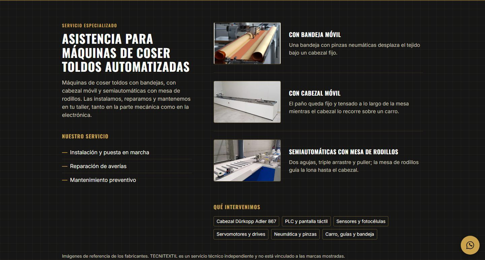

# TECNITEXTIL

Production website for TECNITEXTIL, an industrial sewing machine repair and maintenance business in Spain. A fast, accessible static site whose one job is to turn every visit into a WhatsApp chat or a phone call.

**[Live site](https://tecnitextil.vercel.app)** · [Leer en español](README.es.md)

[](https://github.com/SMarinC/Tecnitextil/actions/workflows/checks.yml)


## Highlights

- **Static HTML, JavaScript only where it is needed.** Astro renders every page at build time. The only client script is the header menu, and browser tests fail if any page downloads more than 15 kB of JavaScript.
- **Native navigation.** Menu links are plain anchors: sections can be shared by URL, the back button works, and smooth scrolling is pure CSS that respects reduced motion.
- **Content separated from code.** All copy and business data live in typed modules in `src/data/`, so text changes never touch components.
- **Accessibility tested in the browser.** Playwright runs axe on every page and fails on serious or critical violations. It also checks that pages reflow at 200% text size on a 320px screen and that the mobile menu works with its accessible names.
- **Performance by default.** Self-hosted Latin-subset fonts preloaded from `<head>`, images resized and converted to WebP at build time, and long-lived caching for hashed assets.
- **Strict security headers.** A Content-Security-Policy that only allows same-origin resources, verified in the browser tests, plus `X-Content-Type-Options`, `X-Frame-Options`, `Referrer-Policy` and `Permissions-Policy`.
- **SEO from a single source.** Canonical URLs, Open Graph tags, `LocalBusiness` structured data, `robots.txt` and `sitemap.xml` all come from one site URL and one page list.

## Screenshots

<p>
  
  
</p>

## Tech stack

Astro 7 · TypeScript · CSS Modules · Vitest 5 · Playwright and axe · Lighthouse CI · ESLint · Prettier · husky and lint-staged · GitHub Actions · Dependabot · Vercel

## Quality gates

Every pull request and every push to `main` runs three CI jobs:

| Job                        | What it checks                                                                                                  |
| -------------------------- | --------------------------------------------------------------------------------------------------------------- |
| Lint, unit tests and build | Prettier formatting, ESLint, unit tests for data, logic, components and pages, and the build with type checking |
| Browser tests              | Playwright on a mobile device (Pixel 7) and on desktop: axe audits, navigation, JavaScript budget and CSP       |
| Lighthouse budgets         | Fails if accessibility is below 95, SEO below 90 or CLS above 0.1; warns on performance, best practices and LCP |

A pre-commit hook formats and lints the staged files, and Dependabot proposes npm updates weekly and GitHub Actions updates monthly.

## Getting started

Requires Node.js 24 (pinned in `.nvmrc`; with nvm, run `nvm use`).

```sh
npm ci
npm run dev          # http://localhost:4321
```

## Scripts

| Command            | What it does                                                                                       |
| ------------------ | -------------------------------------------------------------------------------------------------- |
| `npm run dev`      | Development server with hot reload                                                                 |
| `npm run build`    | Type checks (`astro check`) and builds the static site in `dist/`                                  |
| `npm run preview`  | Serves `dist/` with the same security headers as production                                        |
| `npm test`         | Unit, component and page tests (Vitest)                                                            |
| `npm run test:e2e` | Browser tests (Playwright and axe) against the build. First run: `npx playwright install chromium` |
| `npm run lint`     | ESLint                                                                                             |
| `npm run format`   | Formats the code with Prettier (`format:check` only checks)                                        |

## Project structure

```
src/
  data/             # all copy and business data (edit here)
    company.ts      #   name, phone, coverage
    home.ts         #   text for each section of the home page
    sections.ts     #   section ids and menu
    legal.ts        #   legal notice, privacy policy and owner details
    seo.ts          #   site URL, structured data
    pages.ts        #   every page: title, description, indexing
  pages/            # one file per URL, plus robots.txt and sitemap.xml
  layouts/          # <head> and the legal page template
  components/       # one component per section (.astro + .module.css)
  lib/              # pure, tested functions and the header menu script
  assets/           # images optimized at build time
  styles/           # design tokens and global styles
  test/             # page tests and the render helper
e2e/                # browser tests, one per use case (UC-xx)
```

### Common changes

- **Text, phone number or brands:** edit `src/data/`.
- **A new page:** add a file to `src/pages/` and its entry to `src/data/pages.ts`. The sitemap picks it up unless the page is marked `noindex`.
- **A custom domain:** set the `SITE_URL` environment variable in Vercel (or in a local `.env.local`). It defaults to `https://tecnitextil.vercel.app`.

## Deployment

Vercel builds with `npm run build` and serves `dist/` with clean URLs, security headers and asset caching (see `vercel.json`). Node.js is pinned to `24.x` through `engines`.

Because the Content-Security-Policy only allows same-origin resources, the Vercel preview toolbar (loaded from `vercel.live`) is disabled on purpose with the `VERCEL_PREVIEW_FEEDBACK_ENABLED=0` environment variable in the Vercel project.
